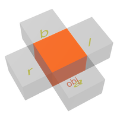
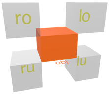

# Spatial Reasoner

> _A flexible 3D Spatial Reasoning library_

__Content__: [Features](#features), [Usage](#usage), [Motivation](#motivation), [Inference Syntax](#syntax-of-spatial-inference-pipeline), [Reference Systems](#spatial-reference_systems), [Spatial Objects](#spatial-objects), [Adjustment](#spatial-adjustment), [BBox Sectors](bbox-sectors), [Spatial Relations](#spatial-relations), [Use Cases](#use-cases)

## Features

* __3D first__: designed from ground up for 3D (not a 2D/GIS extension)
* __Small__: easy to integrate with existing Computer Vision, 3D, VR, XR and AR toolkits
* __Powerful__: inferencing on 3D objects and their spatial relations
* __Extensive__: 100+ spatial predicates and corresponding relations 
* __Comprehensible__: simple yet powerful inference pipeline in textual specification
* __Appropriate__: handles fuzzyness and confidence of spatial situations
* __Flexible__: use for 3D queries, object classification, spatial rule engines, semantic processing in 3D, voice interaction in space, with spatial-related LLM or with Large World Models (LWM), ...
* __Technology-agnostic__: run on various technology platforms
  * use in mobile, desktop, Web and server projects
  * portable inference language
  * independent of left-handed or right-handed 3D coordinate system
* __Cross-platform__: library available in various programming languages
  * [__SRswift__](https://github.com/metason/SRswift) library in __Swift__ for iOS, macOS and visionOS
  * [__SRpy__](https://github.com/metason/SRpy) library in __Python__ (work in progress)
  * __SRmono__ / SRdotnet / SRunity / SRcsharp? library in __C#__ for Unity (work in progress)
  * __SRjs__ library in __JavaScript__ (not yet in planning)

## Usage

The main process of the Spatial Reasoner library consists of the following sequence: 
- match 3D items of your application to spatial objects in fact base  
- derive spatial attributes (done automatically)
- deduce spatial relations (done automatically, configurable)
- run pipeline of inference operations (defined as textual specification)
- access result (on demand repeat with updated fact base)

<details open>
<summary>Swift</summary>

```swift
// map detected or created 3D entities to SpatialObject instances
let obj1 = SpatialObject(id: "1", position: .init(x: -1.5, y: 1.2, z: 0), width: 0.1, height: 1.0, depth: 0.1)
let obj2 = SpatialObject(id: "2", position: .init(x: 0, y: 0, z: 0), width: 0.8, height: 1.0, depth: 0.6)
let obj3 = SpatialObject(id: "3", position: .init(x: 0, y: 0, z: 1.6), width: 0.8, height: 0.8, depth: 0.8)
obj3.angle = .pi/2.0

// initialize reasoner and run pipeline
let sr = SpatialReasoner()
sr.load([obj1, obj2, obj3])
let pipeline = "filter(volume > 0.4) | pick(left AND above) | log()"
if sr.run(pipeline) {
    // result of processed pipeline as list of SpatialObject 
    let result = sr.result()  
    ...
}
```
</details>

<details>
<summary>Python</summary>
tbd
</details>

<details>
<summary>C#</summary>
tbd
</details>

## Motivation

This library deals with representing and reasoning about the topology of spatial 3D objects using derived attributes and deduced relations, such as the adjacency between or the topological arrangement and assembly of spatial objects. Spatial reasoning is the ability to conceptualize the three-dimensional relationships of objects in space and to evaluate spatial conditions in a specific context such as indoor or outdoor environments. Reasoning in the Spatial Reasoner library is executed as a succession of inference operations in a pipeline which takes spatial attributes of and spatial relations between objects into consideration. 

Spatial fuzziness affects information retrieval in space. Object detection in state-of-the-art computer vision, machine learning, and Augmented Reality toolkits results in detected objects that vary their locations and do change and improve over time their orientations and boundaries in space. The object description is usually fuzzy and imprecise, yet some non-trivial conclusion can anyhow be deduced. The geometric confidence typically improves over time. Additionally, by taking spatial domain knowledge into account, semantic interpretation and therefore overall confidence can be improved. It is the goal of the Spatial Reasoner library to improve object detection with domain knowledge using spatial semantic and three-dimensional conditions.

## Syntax of Spatial Inference Pipeline

The spatial inference pipeline is defined as textual specification. The pipeline is a linear sequence of inference operations which cover:
- __adjust__: optional setup to adjust nearby, sector, and max deviation settings
- __deduce__: optional setup to specify relation categories to be deduced
- __filter__: filter objects by matching spatial attributes
- __pick__: pick objects along their spatial relations
- __select__: select objects having spatial relations with others
- __sort__: sort objects by metric attributes or by spatial relations
- __slice__: choose a subsection of spatial objects 
- __calc__: calculate global variables in fact base
- __map__: calculate values of object attributes
- __produce__: create new spatial objects driven by their relations
- __reload__: reload all spatial objects of fact base as new input
- __log__: log the current status of the inference pipeline

The inference operations within the pipeline are separated by "|". An inference operation follows the principle of _input - process - output_. Input and output data are list of spatial objects. The data flows from left to right along the pipeline so that the output of the former becomes the input of the next operation. The pipeline starts with all spatial objects of the fact base as input to the first operation.

Example:
```
filter(volume > 0.4) 
| pick(left AND above) 
| log()
```

The filter, pick, select, slice, produce and reload operations do change the list of output objects to be different from the input. All other operations do pass the list of input objects to the output, but may change sort order of or add attribute values to the spatial objects.

| Op | Syntax | Examples |
| -------- | ------- | -------- | 
| __adjust__  | `adjust(`_settings_`)` | `adjust(max gap 0.05); adjust(sector fixed 1.5); adjust(nearby dimension 2.0); adjust(nearby limit 4.0)` |
| __deduce__  | `deduce(`_relation categories_`)` | `deduce(topology); deduce(connectivity); deduce(visibility); deduce(topology similarity)` |
| __filter__  | `filter(`_attribute conditions_`)` | `filter(id == 'wall1'); filter(width > 0.5 AND height < 2.4); filter(supertype == 'furniture'); filter(thin AND volume > 0.4)` |
| __pick__  | `pick(`_relation conditions_`)` | `pick(near); pick(ahead AND smaller); pick(near AND (left OR right))` |
| __select__  | `select(`_relation ? attribute conditions_`)` | `select(opposite); select(ontop ? id == 'table1'); select(on ? type == 'floor'); select(ahead AND smaller ? footprint < 0.5)` |
| __sort__  | `sort(`_metric attribute_`)` | `sort(length); sort(volume); sort(width <); sort(width >)` |
| __sort__  | `sort(`_relation attribute_`)` | `sort(near.delta); sort(frontside.angle); sort(near.delta <);` |
| __slice__  | `slice(`_range_`)` | `slice(1); slice(2..3); slice(-1); slice(-3..-1); slice(1..-2)` |
| __calc__  | `calc(`_variable assignments_`)` | `calc(cnt = count(objects); calc(maxvol = max(objects.volume); median = median(objects.height))` |
| __map__  | `map(`_attribute assignments_`)` | `map(weight = volume * 140.0); map(type = 'bed'; supertype = 'furniture';` |
| __produce__  | `produce(`_relation_ : _attribute assignments_`)` | `produce(group : type = 'room'); produce(by : label = 'corner'; h = 0.02)` |
| __reload__  | `reload()` | `reload()` |
| __log__  | `log(base 3D `_relations_`)` | `log(); log(base); log(3D); log(near right); log(3D near right)` |

### `adjust()` Operation

Adjust settings of the spatial reasoner to fit the actual context, environment and dominant object size. Call `adjust(...)` at the beginning of the inference pipeline. By setting a calculation schema, the corrsponding factor value can optionally be specified as well. 

```
adjust(max gap 0.02)     // set max deviation
adjust(max angle 0.1)    // set max angle delta
adjust(nearby fixed)     // set nearby calc schema to .fixed
adjust(nearby fixed 1.2) // set nearby calc schema and nearby factor 
adjust(nearby circle)    // set nearby calc schema to .circle
adjust(nearby sphere 2)  // set nearby calc schema to .sphere
adjust(nearby perimeter) // set nearby calc schema to .perimeter
adjust(nearby area)      // set nearby calc schema to .area
adjust(sector fixed)     // set sector calc schema to .fixed
adjust(sector dimension) // set nearby calc schema to .dimension
adjust(sector perimeter) // set nearby calc schema to .perimeter
adjust(sector area 2)    // set nearby calc schema to .area
adjust(sector nearby)    // set nearby calc schema to .nearby
adjust(long ratio 4.0)   // set long ratio
adjust(thin ratio 10.0)  // set thin ratio
```

If `adjust(...)` is not called, the default values are used. See [Spatial Adjustment](#spatial-adjustment) for more details. 

### `deduce()` Operation

Specify the relation categories to be deduced by the spatial reasoner.
Call `deduce(...)` at the beginning of the inference pipeline, e.g., `deduce(visibility)` or `deduce(topology connectivity comparability)`.
When `deduce(...)` is not called, only the topology category is setup by default.

Spatial relation categories that can be set in `deduce(...)` are:
- [topology](Relations.md#topology) (including [proximity](Relations.md#proximity), [directionality](Relations.md#directionality), [adjacency](Relations.md#adjacency), [orientation](Relations.md#orientation), and [assembly](Relations.md#assembly))
- [connectivity](Relations.md#connectivity) (having contact)
- [sectoriality](Relations.md#sectoriality) (being in sector)
- [comparability](Relations.md#comparability)
- [similarity](Relations.md#similarity)
- [visibility](Relations.md#visibility) (seen from observer)
- [geography](Relations.md#geography)

See the [spatial relation categories](Relations.md) and the corresponding grouping of spatial predicates.

### `filter()` Operation

### `pick()` Operation 

### `select()` Operation

### `sort()` by Attributes Operation

### `sort()` by Relations Operation

### `slice()` Operation 

### `calc()` Operation

Calculate global attributes 

Function calls: `average(), sum(), count(), median(), mode(), stddev(), min(), max()`

### `map()` Operation

Calculate local object attributes. 

### `produce()` Operation

Create new spatial objects relative to relations and add them to fact base. Optionally change attributes of the new instances. The `id` is set automatically. When generated objects already exist (identified with their automatically generated `id`), then they will be updated and not created again. Change the `id`in case of enforcing a new object creation.   

```
produce(on : ...)    // create object at footprint face
produce(by : ...)    // create object at touching edge
produce(at : ...)    // create object at meeting face
produce(copy : ...)  // create a copy
produce(group : ...) // create a group object containing all input objects, aligned with largest input object 
```

### `reload()` Operation

Reload all spatial objects of the fact base into the pipeline, also the new prduced ones.

### `log()` Operation

Log files are used for debug purposes and are saved per default in the Downloads folder.

- `log()` or `log(selected relations)`
  - Log as markdown file
  - Overview list of spatial objects
  - Inference pipeline
  - Spatial relations graph (all or selection)
  - Connectivity graph (in case connectivity relations are activated)
  - List of deduced relations
- `log(3D)`
  - Scene of fact base as 3D file (USDZ format in SRswift, GLTF else)
  - Spatial objects rendered in 3D for visualization
- `log(base)`
  - Fact base as JSON file
  - Array of spatial objects with their atrributes
  - Calculated variables with their values
  - Chain of results from processed pipeline

Example of a spatial relation graph:


Example list of deduced spatial relations:
* obj is near to subj (near 𝛥:1.05  𝜶:0.0°)
* obj is left of subj (left 𝛥:0.04  𝜶:0.0°)
* obj is seen right of subj (seenright 𝛥:0.94  𝜶:0.0°)
* ego is near to subj (near 𝛥:3.14  𝜶:153.0°)
* ...

Example of a connectivity graph:


## Spatial Reference Systems

The interpretation of some predicates of spatial relations are depending on the frame of reference. E.g., predicates such as left, right, in front, and at back have different meaning in different reference systems. Additionally, in English language the semantic of spatial predicates is sometimes vague and it is hardly possible to distinquish between terms and their synonyms (e.g., over, above, ontop). Therefore, the meaning of all spatial predicates used in the Spatial Reasoner library are clearly specified. Although the ordinary meaning of the terms has been taken into consideration, the specification in the Spatial Reasoner library might not correspond with its daily use in spoken English language.


The interpretation of spatial predicates and their corresponding relations are only valid in specifc reference systems:
- __World Coordinate System (WCS)__: spatial relations are encoded relative to a global reference point and its orientation.
- __Object Coordinate System (OCS)__: spatial relations are encoded relative to the local position and orientation of an object
- __Egocentric Coordinate System (ECS)__: spatial relations are encoded relative to the position and view direction of an observer
- __Geodetic Coordinate System (GCS)__: spatial relations are encoded relative to earth's projected latitude (north/south) and longitude (east/west)

## Spatial Objects

tbd

## Spatial Adjustment

The spatial reasoner can be adjusted to fit the actual context, environment and dominant object size.
Set adjustment parameters before executing a inference pipeline or before calling the relate() method.
SpatialReasoner has its own local adjustment that should be set upfront programmatically. Otherwise use the `ajust()` operation to set the adjustment parameters.

```swift
class SpatialAdjustment {
    // Max deviations
    var maxGap:Float = 0.05 // max distance of deviation in all directions in meters
    var maxAngleDelta:Float = 0.05 * .pi // max delta of yaw orientation in both directions in radiants 
    // Sector size
    var sectorSchema:SectorSchema = .nearby
    var sectorFactor:Float = 1.0 // multiplying result of claculation schema
    var sectorLimit:Float = 2.5 // maximal length
    // Vicinity
    var nearbySchema:NearbySchema = .circle
    var nearbyFactor:Float = 2.0 //multiplying radius sum of object and subject (relative to size) as max distance
    var nearbyLimit:Float = 2.5 // maximal absolute distance
    // Proportions
    var longRatio:Float = 4.0 // one dimension is factor larger than both others
    var thinRatio:Float = 10.0 // one dimension is 1/factor smaller than both others
}
```

Calculation schema to determine nearby radius of objects's bounding box.

```swift
public enum NearbySchema {
    case fixed // use nearbyFactor as fix nearby radius
    case circle // use base circle radius of bbox multiplied with nearbyFactor
    case sphere // use sphere radius of bbox multiplied with nearbyFactor
    case perimeter // use base perimeter multiplied with nearbyFactor
    case area // use area multiplied with nearbyFactor
}
```

Calculation schema to determine sector size for extruding area to partition space along objects's bounding box (see next chapter).

```swift
public enum SectorSchema {
    case fixed // use sectorFactor for extruding area
    case dimension // use same dimension as object multiplied with factor
    case perimeter // use base perimeter multiplied with factor
    case area // use area multiplied with factor
    case nearby // use nearby settings for extruding
}
```

## BBox Sectors

Object-centric partitioning of space

Different BBox sectors size depending on calculation schema and adjustment settings.

Example of different spatial adjustments and calculation scheme:


left image: `.fized`, middle image: `.dimension`, right image: `.nearby`

   

See detailed description of all [BBox sectors](Sectors.md).


## Spatial Relations

- Spatial relation: subject - predicate - object
- Spatial predicates

    

See detailed description of all [spatial relations](Relations.md).

## Use Cases

### Queries using Object Attributes 


Select a spatial object by its unique identifiier, e.g.:
```
filter(id == 'id1234')
```

Select spatial objects by type attributes, e.g.:
```
filter(supertype == 'furniture' AND (type == 'chair' OR type == 'table'))
```

Select spatial objects by boolean attributes, e.g.:
```
filter(virtual AND NOT moving)
```

Select spatial objects by non-spatial attributes, e.g.:
```
filter(label == 'table' AND confidence.label > 0.7)
```

### Spatial Queries

Select spatial objects by their spatial attributes, e.g.:
```
filter(footprint > 0.5 && height > 1.5)
```

Pick spatial objects by their spatial relations, e.g.:
```
pick(near AND (left OR behind))
```

Select spatial objects by their attributes and their relations, e.g.:
```
filter(height < 0.6 && height > 0.25 && width < 1.3 && length > 1.8)
| select(beside ? type == 'Wall')
| sort(volume)
```

Get nearest spatial object from observer:
```
filter(id == 'observer') 
| pick(disjoint) 
| sort(disjoint.delta <)
| slice(1)
```

### Object Classification

Classify spatial objects by their attributes, e.g.:
```
filter(height < 0.6 && height > 0.25 && width > 1.5 && length > 1.8)
| map(type = 'double bed'; supertype = 'furniture'; confidence = 0.5)
```

Classify spatial objects by their attributes and their topological arrangement, e.g.:
```
filter(height > 1.5 && width > 1.0 && depth > 0.4)
| select(backside ? type == 'wall')
| map(type = 'cabinet'; supertype = 'furniture'; confidence = 0.75)
```

### Production Rules

Create a dublicate of a spatial object, e.g.:
```
filter(id == '1234')
| produce(copy : label = 'copy of 1234'; y = 2.0)
```

Agregate spatial objects by creating a group covering all children's bbox. E.g., create a room object by grouping the existing walls:
```
filter(type == 'wall')
| produce(group : label = 'room')
```

Generate objects at the position where they are connected (at connectivity relations) . E.g., create a spatial object at the corner of each touching wall:
```
filter(type == 'wall')
| produce(by : label = 'corner'; h = 0.02)
```

## Implementation

The design of the Spatial Reasoner Syntax has been first implemented and validated in [SRswift](https://github.com/metason/SRswift) using the Swift programming language by [Philipp Ackermann](mailto:philipp@metason.net?subject=Spatial%20Reasoner). Feel free to take this implementation as reference to implement the Spatial Reasoner Syntax in another programming language. 

Please consider the following hints:
- It is a clear intention that the textual specification of the spatial inference pipeline is cross-platform, so that all confirming to the Spatial Reasoner Syntax can run on any SR implementation.
- Make it transparent when only a subset of the Spatial Reasoner Syntax is covered by your impelementation.
- The Swift programming language is strongly typed which forces SRswift to manage two seperate instances of the fact base in parallel and in sync: 1) as list of objects in `var objects:[SpatialObject]`, and 2) as a list of key-value dictionaries in `var base:Dictionary<String, Any>`. The dictionary representation is needed to provide read/write access to the predicate evaluater and expression interpreter.
- If you implement a Spatial Reasoner in a programming language that is not strongly typed (e.g., Python or JavaScript), do avoid a duplicate representation of the fact base.
- The trickiest part of implementing another SR library might be the interpretation of predicates and expressions. A predicate is a logical statement that evaluates to a Boolean value (true or false) and is used in SR to evaluate conditions of attributes and existance of relations. An expression does perform operations or calculations and is used in SR for attribute evaluation and assignments. Analyze in an early stage `SpatialInference.swift` to elaborate how to solve predicates and expressions in your implementation. 
- The interpretation of the Spatial Reasoner Syntax should be independent of left-handed or right-handed 3D coordinate system. The SRswift implementation is internally using a right-handed coordinate system. Take special care in translating the SRswift reference implementation if the underlying coordinate system of the 3D toolkit of your implementation is different. 
- SRswift includes extensive test cases. It is a good idea to also validate your own implementation with automatic tests.
- Some test cases are "misused" to generate visualizations that are included in this documentation. These test cases (named *Vis) do not have to be covered in your tests. 

If you plan to release your implementation as Open Source, please feel free to contact [Philipp](mailto:philipp@metason.net?subject=Spatial%20Reasoner) to get your SR library listed under [features](#features) in this document. Ideas for improvements are also welcome.

## License

Released under the [Creative Commons CC0 License](LICENSE).