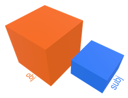
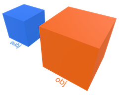
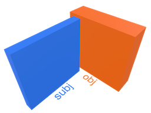
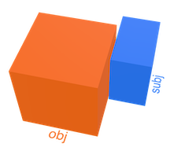
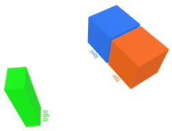
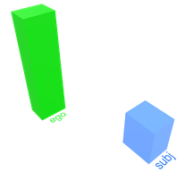
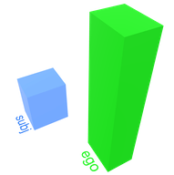
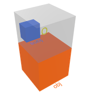

# Spatial Relations

Spatial relations are described by spatial predicates - keywords that indicate the type of relationship each spatial object has with another. Spatial relations are expressed as semantic triples:

> _subject_ - __predicate__ - _object_

The spatial objects in the visual samples are represented as boxes (bounding box of the object) and their label indicates their front side. 

__Spatial Relation Categories__

- [Topology](#topology): [Proximity](#proximity), [Directionality](#directionality), [Adjacency](#adjacency), [Orientation](#orientation), [Assembly](#assembly)
- [Connectivity](#connectivity)
- [Visibility](#visibility)
- [Sectoriality](#sectoriality)
- [Comparability](#comparability)
- [Similarity](#similarity)
- [Geography](#geography)

## Topology

To enable the derivation of topology relations, call `deduce(topology)` at the beginning of the pipeline or set `deduce.topology = true` of the spatial reasoner.

### Proximity

| Predicate | Relation  | Specification | Visual Sample |
| --- | ---- | ---- | -------- | 
| `near` | subj is __near__ by obj | <ul><li>center of subject is not inside / not in `.i` sector</li><li>center distance < nearby condition of adjustment</li><li>delta = center distance</li></ul> |   |
| `far` | subj is __far__ from obj | <ul><li>is far, not near</li><li>center distance > nearby condition of adjustment</li><li>delta = center distance</li></ul> |  |

### Directionality

| Predicate | Relation  | Specification | Visual Sample |
| --- | ---- | ---- | -------- | 
| `left` | subj is __left__ of obj | <ul><li>center of subject is left from object</li><li>may overlap</li><li>no distance condition</li><li>valid in OCS</li><li>delta = center distance</li></ul>  |  |
| `right` | subj is __right__ of obj | <ul><li>center of subject is right from object</li><li>may overlap</li><li>no distance condition</li><li>valid in OCS</li><li>delta = center distance</li></ul> |  |
| `ahead` | subj is __ahead__ of obj | <ul><li>center of subject is ahead of object</li><li>may overlap</li><li>no distance condition</li><li>valid in OCS</li><li>delta = center distance</li></ul> |   |
| `behind` | subj is __behind__ obj | <ul><li>center of subject is behind object</li><li>may overlap</li><li>no distance condition</li><li>valid in OCS</li><li>delta = center distance</li></ul> |  |
| `above` `over` | subj is __above__ obj subj is __over__ obj |<ul><li>center of subject is above object</li><li>may overlap</li><li>no distance condition</li><li>valid in WCS, OCS, ECS</li><li>delta = center distance</li></ul> |   |
| `below` `under` | subj is __below__ obj subj is __under__ obj | <ul><li>center of subject is below object</li><li>may overlap</li><li>no distance condition</li><li>valid in WCS, OCS, ECS</li><li>delta = center distance</li></ul> |  |

### Adjacency

| Predicate | Relation  | Specification | Visual Sample |
| --- | ---- | ---- | -------- | 
| `leftside` | subj is at __leftside__ of obj | <ul><li>center of subject is in `.l` sector</li><li>is near</li><li>is not overlapping</li><li>valid in OCS</li><li>delta = min distance</li></ul> |   |
| `rightside` | subj is at __rightside__ of obj | <ul><li>center of subject is in `.r` sector</li><li>is near</li><li>is not overlapping</li><li>valid in OCS</li><li>delta = min distance</li></ul> |  |
| `frontside` | subj is at __frontside__ of obj | <ul><li>center of subject is in `.a` sector</li><li>is near</li><li>is not overlapping</li><li>valid in OCS</li><li>delta = min distance</li></ul>  |  |
| `backside` | subj is at __backside__ of obj | <ul><li>center of subject is in `.b` sector</li><li>is near</li><li>is not overlapping</li><li>valid in OCS</li><li>delta = min distance</li></ul> |  |
| `beside` | subj is __beside__ obj | <ul><li>is near</li><li>is not above or not below</li><li>is not overlapping</li><li>valid in WCS, OCS, ECS</li><li>delta = center distance</li></ul> |  |
| `upperside` | subj is at __upperside__ of obj | <ul><li>center of subject is in `.o` sector</li><li>is near</li><li>is not overlapping</li><li>valid in WCS, OCS, ECS</li><li>delta = min distance</li></ul>  |  |
| `lowerside` | subj is at __lowerside__ of obj | <ul><li>center of subject is in `.u` sector</li><li>is near</li><li>is not overlapping</li><li>valid in WCS, OCS, ECS</li><li>delta = min distance</li></ul> |  |
| `ontop` | subj is __ontop__ of obj | <ul><li>center of subject is in `.o` sector</li><li>is near</li><li>is not overlapping</li><li>min distance < max gap</li><li>valid in WCS, OCS, ECS</li><li>delta = min distance</li></ul>  |  |
| `beneath` | subj is __beneath__ obj | <ul><li>center of subject is in `.u` sector</li><li>is near</li><li>is not overlapping</li><li>min distance < max gap</li><li>valid in WCS, OCS, ECS</li><li>delta = min distance</li></ul> |  |

### Orientation

| Predicate | Relation  | Specification | Visual Sample |
| --- | ---- | ---- | -------- | 
| `aligned` | subj is __aligned__ with obj | <ul><li>same angle orientation</li><li>angle diff < max angle</li><li>valid in OCS</li><li>delta = central distance</li></ul>  |  |
| `frontaligned` | subj is __front aligned__ with obj | <ul><li>same angle orientation</li><li>angle diff < max angle</li><li>aligned front side</li><li>min distance < max gap</li><li>valid in OCS</li><li>delta = min distance</li></ul> |  |
| `backaligned` | subj is __back aligned__ with obj | <ul><li>same angle orientation</li><li>angle diff < max angle</li><li>aligned back side</li><li>min distance < max gap</li><li>valid in OCS</li><li>delta = min distance</li></ul> |  |
| `rightaligned` | subj is __right aligned__ with obj | <ul><li>same angle orientation</li><li>angle diff < max angle</li><li>aligned right side</li><li>min distance < max gap</li><li>valid in OCS</li><li>delta = min distance</li></ul> |  |
| `leftaligned` | subj is __left aligned__ with obj | <ul><li>same angle orientation</li><li>angle diff < max angle</li><li>aligned left side</li><li>min distance < max gap</li><li>valid in OCS</li><li>delta = min distance</li></ul> |  |
| `orthogonal` | subj is __orthogonal__ to obj | <ul><li>is perpendicular</li><li>angle diff < max angle ±90°</li><li>valid in OCS</li></ul> |   |
| `opposite` | subj is __opposite__ to obj | <ul><li>are facing each other</li><li>angle diff < max angle ±180°</li><li>valid in OCS</li><li>delta = center distance</li></ul> |  |

### Assembly

| Predicate | Relation  | Specification | Visual Sample |
| --- | ---- | ---- | -------- | 
| `disjoint` | subj is __disjoint__ from obj | <ul><li>no overlap</li><li>valid in WCS, OCS, ECS</li><li>delta = center distance</li></ul>  |  |
| `inside` | subj is __inside__ obj | <ul><li>is inside</li><li>valid in WCS, OCS, ECS</li><li>delta = center distance</li></ul> |  |
| `containing` | subj is __containing__ obj | <ul><li>is containing</li><li>valid in WCS, OCS, ECS</li><li>delta = center distance</li></ul> |  |
| `overlapping` | subj is __overlapping__ with obj | <ul><li>is overlapping but not crossing</li><li>valid in WCS, OCS, ECS</li><li>delta = center distance</li></ul> |  |
| `crossing` | subj is __crossing__ obj | <ul><li>is crossing</li><li>valid in WCS, OCS, ECS</li><li>delta = center distance</li></ul> |  |
| `touching` | subj is __touching__ obj | <ul><li>is touching with an edge or corner only</li><li>min distance < max gap</li><li>valid in WCS, OCS, ECS</li><li>delta = min distance</li></ul> |   |
| `meeting` | subj is __meeting__ obj | <ul><li>is touching with a face</li><li>angle diff < max angle ±90°</li><li>min distance < max gap</li><li>valid in WCS, OCS, ECS</li><li>delta = min distance</li></ul> |  |

## Connectivity

To enable the derivation of conectivity relations, call `deduce(conectivity)` at the beginning of the pipeline or set `deduce.conectivity = true` of the spatial reasoner.
 
| Predicate | Relation  | Specification | Visual Sample |
| --- | ---- | ---- | -------- | 
| `on` | subj is __on__ obj | <ul><li>is near</li><li>is on top</li><li>min distance < max gap</li><li>valid in WCS, OCS, ECS</li><li>delta = min distance</li></ul>  |  |
| `at` | subj is __at__ obj | <ul><li>is beside</li><li>is meeting</li><li>min distance < max gap</li><li>valid in WCS, OCS, ECS</li><li>delta = min distance</li></ul> |  |
| `by` | subj is __by__ obj | <ul><li>is touching</li><li>min distance < max gap</li><li>valid in WCS, OCS, ECS</li><li>delta = min distance</li></ul> |   |
| `in` | subj is __in__ obj | <ul><li>is inside</li><li>valid in WCS, OCS, ECS</li></ul> |  |

## Visibility

To enable the derivation of visibility relations, call `deduce(visibility)` at the beginning of the pipeline or set `deduce.visibility = true` of the spatial reasoner.
 
| Predicate | Relation  | Specification | Visual Sample |
| --- | ---- | ---- | -------- | 
| `infront` | subj is __in front__ of obj | <ul><li>is seen in front of</li><li>valid in ECS</li><li>delta = center distance</li></ul>  |  |
| `atrear` | subj is __at rear__ of obj | <ul><li>is seen at rear of</li><li>valid in ECS</li><li>delta = center distance</li></ul> |  |
| `seenright` | subj is __seen right__ of obj | <ul><li>is seen right of</li><li>valid in ECS</li><li>delta = center distance</li></ul> |   |
| `seenleft` | subj is __seen left__ of obj | <ul><li>is seen left of</li><li>valid in ECS</li><li>delta = center distance</li></ul> |  |
| `elevenoclock` | subj is at __eleven'o'clock__ | <ul><li>is seen at eleven'o'clock by ego</li><li>valid in ECS</li><li>delta = center distance</li</ul> |  |
| `twooclock` | subj is at __two'o'clock__ | <ul><li>is seen at two'o'clock by ego</li><li>valid in ECS</li><li>delta = center distance</li</ul> |  |
| `eightoclock` `nineoclock` `tenoclock` `twelveoclock` `oneoclock` `threeoclock` `fouroclock` | dito | <ul><li>dito</li></ul> |

## Sectoriality

To enable the derivation of sectoriality relations, call `deduce(sectoriality)` at the beginning of the pipeline or set `deduce.sectoriality = true` of the spatial reasoner. 

| Predicate | Relation  | Specification | Visual Sample |
| --- | ---- | ---- | -------- | 
| `o` | subj is in sector __o__ of obj | <ul><li>center of subj is in sector `o` </li><li>is over</li><li>valid in OCS</li><li>delta = center distance</li></ul>  |  |
| `br` | subj is in sector __br__ of obj | <ul><li>center of subj is in sector `br` </li><li>is behind right</li><li>valid in OCS</li><li>delta = center distance</li></ul>  |  |
| `bru` | subj is in sector __bru__ of obj | <ul><li>center of subj is in sector `bru` </li><li>is behind right under</li><li>valid in OCS</li><li>delta = center distance</li></ul>  |  |

See detailed description of all available [BBox sectors](Sectors.md) that are also available as predicates.

## Comparability

To enable the derivation of comparability relations, call `deduce(comparability)` at the beginning of the pipeline or set `deduce.comparability = true` of the spatial reasoner.

| Predicate | Relation  | Specification |
| --- | ---- | ---- |
| `shorter` | subj is __shorter__ than obj | <ul><li>length is shorter</li><li>valid in WCS, OCS, ECS</li><li>delta = height difference</li></ul> | 
| `longer` | subj is __longer__ than obj | <ul><li>length is larger</li><li>valid in WCS, OCS, ECS</li><li>delta = length difference</li></ul> | 
| `taller` | subj is __taller__ than obj | <ul><li>height is larger</li><li>valid in WCS, OCS, ECS</li><li>delta = length difference</li></ul> | 
| `thinner` | subj is __thinner__ than obj | <ul><li>obj is long</li><li>footprint is smaller</li><li>valid in WCS, OCS, ECS</li><li>delta = footprint difference</li></ul> | 
| `wider` | subj is __wider__ than obj | <ul><li>obj is long</li><li>footprint is larger</li><li>valid in WCS, OCS, ECS</li><li>delta = footprint difference</li></ul> | 
| `smaller` | subj is __smaller__ than obj | <ul><li>bbox volume is smaller</li><li>valid in WCS, OCS, ECS</li><li>delta = volume difference</li></ul> | 
| `bigger` | subj is __bigger__ than obj | <ul><li>bbox volume is bigger</li><li>valid in WCS, OCS, ECS</li><li>delta = volume difference</li></ul> | 
| `fitting` | subj is __fitting__ into obj | <ul><li>is fitting within</li><li>valid in WCS, OCS, ECS</li><li>delta = volume difference</li></ul> | 
| `exceeding` | subj is __exceeding__ obj | <ul><li>is not fitting within</li><li>valid in WCS, OCS, ECS</li><li>delta = volume difference</li></ul> | 

## Similarity

To enable the derivation of similarity relations, call `deduce(similarity)` at the beginning of the pipeline or set `deduce.similarity = true` of the spatial reasoner.

., ., ., ., ., ., ., .

| Predicate | Relation  | Specification |
| --- | ---- | ---- |
| `sameheight` | subj has __sameheight__ as obj | <ul><li>height difference < max gap</li><li>valid in WCS, OCS, ECS</li><li>delta = height difference</li></ul> | 
| `samewidth` | subj has __samewidth__ as obj | <ul><li>width difference < max gap</li><li>valid in WCS, OCS, ECS</li><li>delta = width difference</li></ul> | 
| `samedepth` | subj has __samedepth__ as obj | <ul><li>depth difference < max gap</li><li>valid in WCS, OCS, ECS</li><li>delta = depth difference</li></ul> | 
| `samelength` | subj has __samelength__ as obj | <ul><li>lenght difference < max gap</li><li>valid in WCS, OCS, ECS</li><li>delta = length difference</li></ul> | 
| `sameperimeter` | subj has __sameperimeter__ as obj | <ul><li>perimeter difference < 4*(max gap)</li><li>valid in WCS, OCS, ECS</li><li>delta = perimeter difference</li></ul> | 
| `samefront` | subj has __samefront__ as obj | <ul><li>front area difference < (max gap)2</li><li>valid in WCS, OCS, ECS</li><li>delta = front area difference</li></ul> | 
| `sameside` | subj has __sameside__ as obj | <ul><li>side area difference < (max gap)2</li><li>valid in WCS, OCS, ECS</li><li>delta = side area difference</li></ul> | 
| `samefootprint` | subj has __samefootprint__ as obj | <ul><li>base area difference < (max gap)2</li><li>valid in WCS, OCS, ECS</li><li>delta = base area difference</li></ul> | 
| `samesurface` | subj has __samesurface__ as obj | <ul><li>surface difference < 3*(max gap)2</li><li>valid in WCS, OCS, ECS</li><li>delta = volume difference</li></ul> | 
| `samevolume` | subj has __samevolume__ as obj | <ul><li>volume difference < (max gap)3</li><li>valid in WCS, OCS, ECS</li><li>delta = volume difference</li></ul> | 
| `samecuboid` | subj has __samecuboid__ as obj | <ul><li>`samewidth AND samedepth AND sameheight`</li><li>valid in WCS, OCS, ECS</li><li>delta = volume difference</li></ul> | 
| `congruent` | subj is __congruent__ with obj | <ul><li>`samewidth AND samedepth AND sameheight`</li><li>same orientation/ same angle</li><li>valid in WCS, OCS, ECS</li><li>delta = volume difference</li></ul> | 
| `sameposition` | subj has __sameposition__ as obj | <ul><li>position difference < max gap</li><li>valid in WCS, OCS, ECS</li><li>delta = position difference</li></ul> | 
| `samecenter` | subj has __samecenter__ as obj | <ul><li>center difference < max gap</li><li>valid in WCS, OCS, ECS</li><li>delta = center difference</li></ul> | 
| `sameshape` | subj has __sameshape__ as obj | <ul><li>same shape attribute</li><li>valid in WCS, OCS, ECS</li><li>delta = volume difference</li></ul> | 

## Geography

To enable the derivation of geography relations, call `deduce(geography)` at the beginning of the pipeline or set `deduce.geography = true` of the spatial reasoner.

The geographic direction in WCS include: `north, south, east, west, northwest, northeast, southwest, southeast`. A sample geographic relations: 

| Predicate | Relation  | Specification |
| --- | ---- | ---- |
| `north` | subj is __north__ of obj | <ul><li>center is in north direction ±22.5°</li><li>valid in WCS</li></ul> | 
| `northeast` `east` `southeast` `south` `southwest` `west` `northwest` | dito | <ul><li>dito</li></ul> |

