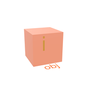
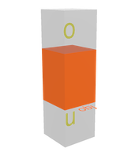
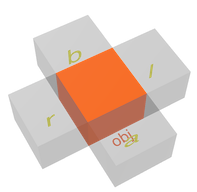
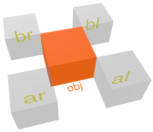
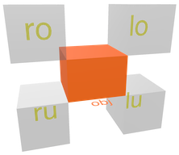
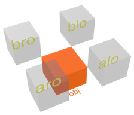
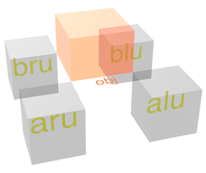

# Bounding Box Sectors

Object-centric partitioning of space along the cardinal directions
of the bounding box (bbox). The 3x3x3 BBox sector matrix leads to 27 object-related boundary sectors.

## No Divergency

| Sector | Name  | Specification | Visual Sample |
| --- | ---- | ---- | -------- | 
| `i` | __inner__| <ul><li>inside of bbox</li></ul>  |  |

## Single Divergency
 
| Sector | Name  | Specification | Visual Sample |
| --- | ---- | ---- | -------- | 
| `o` | __over__ | <ul><li>over bbox</li></ul>  |  |
| `u` | __under__ | <ul><li>under bbox</li></ul> |  |
| `l` | __left__ | <ul><li>left ofbbox</li></ul>  |  |
| `r` | __right__ | <ul><li>right of bbox</li></ul> |  |
| `a` | __ahead__ | <ul><li>ahead of bbox</li></ul> |  |
| `b` | __behind__ | <ul><li>behind bbox</li></ul> |  |

## Double Divergency

| Sector | Name  | Specification | Visual Sample |
| --- | ---- | ---- | -------- | 
| `al` | __ahead left__ | <ul><li>ahead left of bbox</li></ul>  |  |
| `ar` | __ahead right__ | <ul><li>ahead right of bbox</li></ul> |  |
| `bl` | __behind left__ | <ul><li>behind left of bbox</li></ul> |  |
| `br` | __behind right__ | <ul><li>behind right of bbox</li></ul> |  |
| `ao` | __ahead over__ | <ul><li>ahead over of bbox</li></ul>  |  |
| `au` | __ahead under__ | <ul><li>ahead under of bbox</li></ul> |  |
| `bo` | __behind over__ | <ul><li>behind over of bbox</li></ul> |  |
| `bu` | __behind under__ | <ul><li>behind under of bbox</li></ul> |  |
| `lo` | __left over__ | <ul><li>left over of bbox</li></ul>  |  |
| `lu` | __left under__ | <ul><li>left under of bbox</li></ul> |  |
| `ro` | __right over__ | <ul><li>right over of bbox</li></ul> |  |
| `ru` | __right under__ | <ul><li>right under of bbox</li></ul> |  |
 
## Triple Divergency

| Sector | Name  | Specification | Visual Sample |
| --- | ---- | ---- | -------- | 
| `alo` | __ahead left over__ | <ul><li>ahead left over of bbox</li></ul>  |  |
| `aro` | __ahead right over__ | <ul><li>ahead right over of bbox</li></ul> |  |
| `blo` | __behind left over__ | <ul><li>behind left over of bbox</li></ul> |  |
| `bro` | __behind right over__ | <ul><li>behind right over of bbox</li></ul> |  |
| `alu` | __ahead left under__ | <ul><li>ahead left over of bbox</li></ul>  |  |
| `aru` | __ahead right under__ | <ul><li>ahead right under of bbox</li></ul> |  |
| `blu` | __behind left under__ | <ul><li>behind left  over of bbox</li></ul> |  |
| `bru` | __behind right under__ | <ul><li>behind right under of bbox</li><ul> |  |
