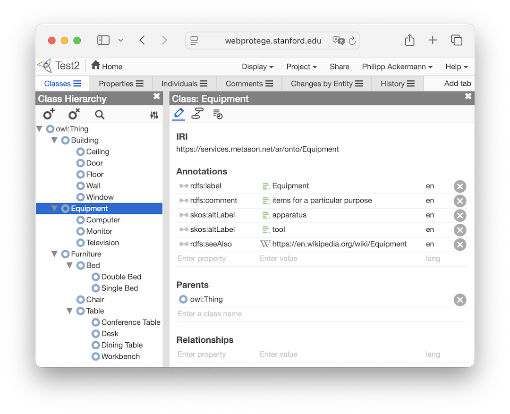
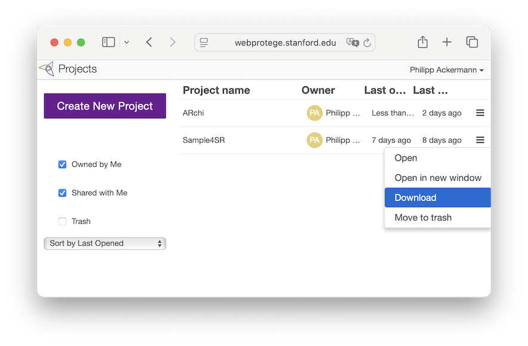

# Spatial Taxonomy

## Spatial Relation Terminology

All spatial predicates with their code, verbal predicate, preposition, verb, synonyms, antonym and inverse definitions are specified and are available as terminology in [terms.json](terms.json) as JSON file. These spatial terms build a foundation to integrate the Spatial Reasoner framework with LLM, NLP, and TTS. 

```json
{
    "code" : "seenleft",
    "predicate" : "seen left",
    "category" : "visibility",
    "antonym" : "",
    "inverse" : "seen right",
    "preposition" : "of",
    "synonyms" : "visible to the left",
    "verb" : "is"
}
```

## Type System for Spatial Objects

Spatial objects have a `type` attribute which can be embedded into a class hierachy to reflect entity inheritance relations.
Before using the `ìsa(type)` operator, you have to load a domain-specific taxonomy into the Spatial Reasoner library. As a base import for an ontology that defines an entity taxonomy, the OWL/RDF format is supported. 

```swift
// load specific taxonomy in OWL/RDF format as XML file
let url = URL(string: "https://service.metason.net/ar/onto/test.owl") 
SpatialTaxonomy.load(from: url)

// initialize reasoner and run pipeline
let sr = SpatialReasoner()
...
```

### OWL Ontology

[OWL](https://www.w3.org/OWL) is an ontology language designed for the Semantic Web and is a W3C standard, promoting interoperation and sharing between applications. Ontologies provide a machine-readable understanding of a domain that can be communicated across applications. The Spatial Reasoner uses OWL to explicitly represent the type hierarchy of spatial objects.

OWL builds upon the Resource Description Framework ([RDF](http://www.w3.org/RDF)) and upon RDF Schema (RDFS) to support the definition of basic vocabulary terms and the relations between those terms such as `subClassOf`. 

Spatial Reasoner is using OWL to import a taxonomy that defines a hierarchical type system with `subClassOf` inheritance for spatial objects. Thanks to the dynamic loading of an application-specific taxonomy, the Spatial Reasoner can be flexibly adapted to the type and label systems used by underlying Computer Vision libraries and Machine Learning models.

The OWL import into Spatial Reasoner considers the following associations:
- name: `rdfs:label`
- inheritance: `rdfs:subClassOf`
- comment: `rdfs:comment`
- reference URL: `rdfs:seeAlso`
- synonym: `skos:altLabel`

The `ìsa(type)` operator checks for correspondence with the name and label of the class as well as optionally specified synonyms along the class hierarchy in the loaded taxonomy.

### WebProtégé OWL Editor

WebProtégé is a cloud-based application that allows users to collaboratively edit OWL ontologies. It is available for free at https://webprotege.stanford.edu. WebProtégé can be used for the definition of a taxonomy that can be imported into Spatial Reasoner. The follwoing two examples have been created with WebProtégé:
- [test.owl](test.owl)
- [https://service.metason.net/ar/onto/archi.owl](https://service.metason.net/ar/onto/archi.owl)




Steps to create a taxonomy for Spatial Reasoner:
- Navigate to the web site of [WebProtégé](https://webprotege.stanford.edu)
- _Sign up for account_ in the up-right corner, in case you don’t have registered yet
- _Create New Project_
  - optionally load an existing OWL file (e.g., an example from above)
- First define iri prefix and iri suffix in the Project-Settings
- Build your class hierachy and specifiy corresponding annotations for synonyms
- Go back to the Home screen
- Open the project menu on the far right 
- Choose Download and then the RDF/XML format 
- The saved OWL file is ready to be imported as type system into Spatial Reasoner


